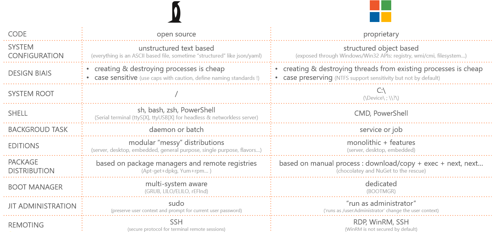
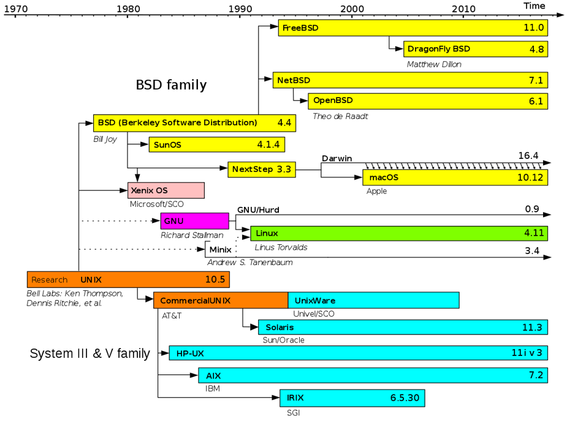
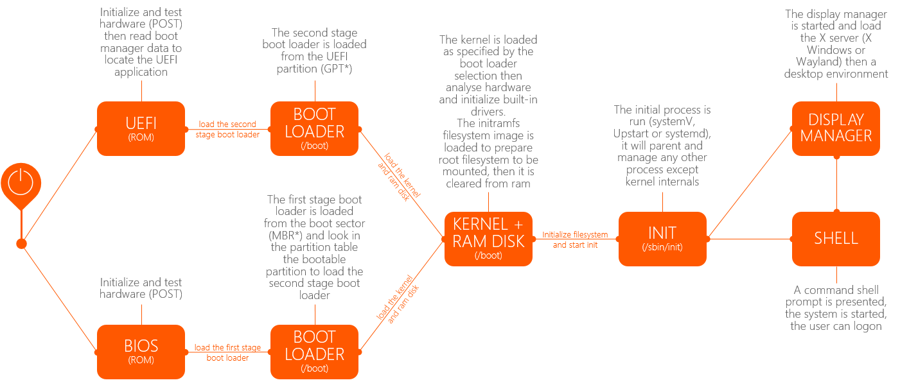
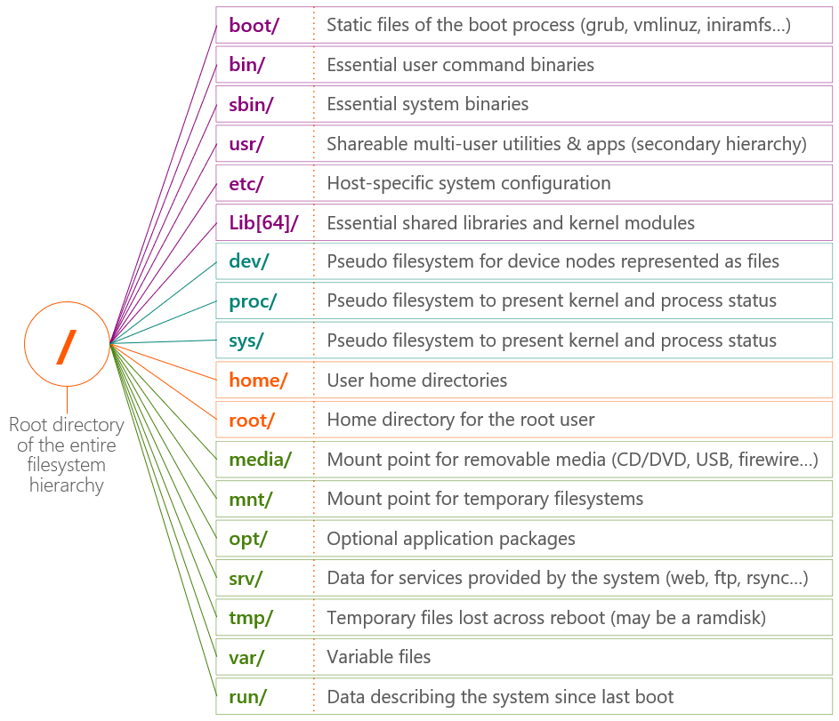
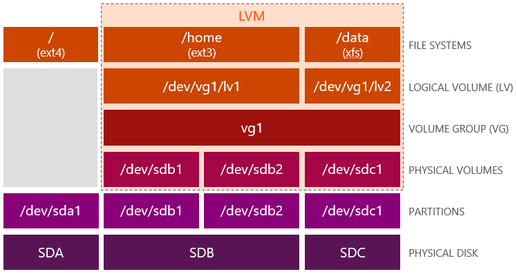

# Linux 101 for the Windows admin

## AGENDA

* [**LINUX vs WINDOWS**](#linux-vs-windows)
* [**BASIC COMMANDS**](#basic-commands)
* [**PACKAGE MANAGER**](#package-manager)
* [**TEXT OPERATIONS**](#text-operations)
* [**LAB 1**](lab-01/README.md)
* [**BOOT SEQUENCE**](#boot-sequence)
* [**STORAGE**](#storage)
* [**NETWORK**](#network)
* [**ENVIRONMENT CONFIG**](#environment-config)
* [**LAB 2**](lab-02/README.md)
* [**SYSTEM ACTIVITY**](#system-activity)
* [**LOCAL IDENTITY MANAGEMENT**](#local-identity-management)
* [**LAB 3**](lab-03/README.md)
* [**LAB 4**](lab-04/README.md)

## LINUX vs WINDOWS

### concepts & terminology



### Linux diversity

**Linux** was originally developed by **Linus Torvalds** based on **Minix** for the kernel and the **GNU** project for user space (applications, tools, services). Linux has now many distribution with each its subsequent flavors.

The mains distributions include :
* **Debian** based, including Ubuntu
* **Slackware** based including SuSE
* **RedHat** based including CentOS and Fedora
* **Arch Linux**
* **Android**




## BASIC COMMANDS

### **basic file/directory operations & permissions**

* In Linux systems, every access divides into three categories, owner, groups or world
* Permissions are none (**-**), read (**r**), write (**w**), execute (**x**) granted for owner/user (**u**), Group (**g**), and world/others (**o**).
* Permissions are displayed in four parts :
    * **Type**: first digit (‘**-**’ for file, ‘**d**’ for dir, ‘**l**’ for link…)
    * **Owner** : three digits (r--, rw-, rwx, r-x…)
    * **Group** : three digits (r--, rw-, rwx, r-x…)
    * **World** : three digits (r--, rw-, rwx, r-x…)
* Permissions are modified using two syntax, symbolic or octal where **4** is read, **2** is write and **1** is execute.
    * **Symbolic** : chmod uo+x, g-w file
    * **Octal** : chmod 755 file
* Access is granted based on sequential evaluation:
    * Is the user owner of the file > apply owner permissions
    * Is the user part of the group > apply group permission
    * The user does meet previous criteria > apply world permissions
* The **umask** is a filter expressed in octal which removes some permissions from the ones inherited when creating files and directories (ex: 0666 – 0002 = 0664)
* Linux also implement POSIX compliant ACLs

#### Commands

|        |                            FILE/DIRECTORY OPERATIONS                            |
|--------|---------------------------------------------------------------------------------|
| pwd    | Show current directory (present working directory)                              |
| cd     | Change directory (‘~’ or empty for home, ‘..’ for parent, ‘-’ for previous)     |
| ls     | List files (‘-a’ for all, ‘-R’ for recursive, ‘-l’ for permissions)             |
| mv     | Move or rename file                                                             |
| cp     | Copy files (or directory with ‘-R’ parameter)                                   |
| find   | Locate files and directories based on complex queries (name, perm, regex…)      |
| mkdir  | Create directory                                                                |
| rmdir  | Delete directory                                                                |
| rm     | Delete file (or directory with ‘-R’ parameter)                                  |
| touch  | Update file’s last modified metadata (used generally to create empty files)     |
| chmod  | Change permissions of a file or directory                                       |
| chown  | Change user ownership of a file or directory                                    |
| chgrp  | Change group ownership of a file or directory (chown can be used as well)       |
| umask  | Change default umask to remove inherited permissions                            |
| gzip   | Compress files and directories (‘bzip2’ and ‘xz’ have higher compression rate)  |
| gunzip | De-compress ‘*.gz’ archives (‘bunzip2’ for ‘*.bz2’ archives)                    |
| tar    | Create archives (uncompressed by default .tar but can be compressed to .tar.gz) |

#### Exemples

```
$ mkdir cooldir ; ls
$ cd cooldir ; touch cool ; ls
$ mv cool pascool ; ls
$ cp pascool cool ; find /home/ -name "cool*"
$ chmod ug+x,o-w cool ; ls -l cool
$ chmod 755 cool ; ls -l cool
$ sudo chgrp root cool ; ls -l cool
$ sudo chown root cool ; ls -l cool
$ sudo chown anto:anto cool ; ls -l cool
$ tar -cf cool.tar cool pascool ; ls
$ gzip cool.tar ; ls
$ rm cool pascool ; ls
$ tar -xzf cool.tar.gz ; ls
$ cd ..
$ rm -R cooldir
```

### **help, permission elevation, remoting & power management**

* Help can be found in the Linux “manual pages” using **‘man’** tool or in the “GNU info system”, which is structured with links, using **‘info’** tool.
* Linux provide **‘su** and **‘sudo’** commands to “run as” a different user, in general root for privilege elevation.
* **‘su’** (substitute user) is usually used to “run as” root **a new shell** until the shell is exited. It requires to know **root password** so it **should be avoided**.
* **‘sudo’** is usually used to “run as” root **a single command** using **current user’s password** (subsequent sudo wont prompt for the next 15mn)
* ‘sudo’ is configured on a per user basis with files located in **‘/etc/sudoers.d/’** (main user configured by default on Ubuntu).
* Power control of the system is managed by **‘shutdown’** and require elevated privileges.
* On Ubuntu, **‘shutdown’** with no options (such as “now”) does not shutdown the system but switch to single user mode (run level 1 or recovery mode with filesystem mounted)
* **SSH** use both public/private key pair (asymmetric encryption) for authentication and secret keys (symmetric encryption) for traffic encryption.
* SSH keys on client are stored by default in **‘/home/[user]/.ssh/’** including private key **‘id_rsa’** and public key **‘id_rsa.pub’**
* User’s SSH public key must be stored on remote server(s) in **‘/home/[user]/.ssh/authorized_keys’**
* When connecting the first time to a server, a warning is displayed to accept the connection and add the server’s public host key in **‘/home/[user]/.ssh/known-hosts’** (this is not the user’s public key but the server’s host key ‘ssh_host_rsa_key.pub’)
* SSH support **multiple authentication protocols** in addition to pub/priv key, including Kerberos and basic (password : which might be disabled)

#### Commands

|            | DAILY COMMANDS                                                                                                                                                                    |
|------------|-----------------------------------------------------------------------------------------------------------------------------------------------------------------------------------|
| man        | Query “Manual pages” (‘-f’ to list dedicated pages on a topic, ‘-k’ to list all pages with reference to a topic)                                                                  |
| info       | Query “GNU info pages”                                                                                                                                                            |
| echo       | Display a line of text                                                                                                                                                            |
| wget       | Basic web client to perform http/ftp requests (often used to download files)                                                                                                      |
| su         | Substitute to a specific user, ‘root’ if no argument is specified (the prompt will be ‘#’ instead of ‘$’)                                                                         |
| sudo       | Elevate privileges temporarily using current user context and password (‘-i’ to preserve target user environments, ‘-s’ to start a new shell instead of an individual command)    |
| ssh-keygen | Menu driven tool to generate key pairs for SSH authentication (default algorithm is RSA)                                                                                          |
| ssh        | Establish a Secure Shell connection to a remote host using. It can also be used to redirect specific port to a remote host with TCP forwarding or all traffic with SSH tunneling. |
| shutdown   | Manage power control (‘-r’ for reboot’, ‘-h’ for shutdown)                                                                                                                        |

#### Exemples

```
$ man woman
$ man man
$ man -f sudo
$ man –k sudo
$ info sudo
$ wget microsoft.com
$ su
# echo "anto ALL=(ALL) ALL" > /etc/sudoers.d/anto
# chmod 440 /etc/sudoers.d/anto
# exit
$ ssh-keygen –t rsa –b 2048
$ chmod 600 id.rsa
$ ssh anto@nixvm.westeurope.cloudapp.azure.com
$ sudo shutdown –r +3 “shutting down for kernel update”
$ sudo shutdown now
```

## PACKAGE MANAGER

* Responsible for installation, upgrade, configuration, integrity check, removal of packages in an automated and predictable fashion
* Two types of package managers, **low level** and **high level**
* Low level utilities such as **rpm** and **dpkg** list, install, update or remove packages without managing dependencies other than warn.
* High level utilities such as **yum** and **apt** resolve dependencies on top of low level utilities:
    * Install automatically dependencies
    * Prompt for aborting or removing dependencies which might be used by other packages
* High level utilities rely on database to find available packages for installation or update. Database source can be both local or remote repositories
* Individual **apt-get** and **apt-cache** commands are now being replaced by a unique **apt** command
* Both low level and high level package manager can **remove** or **purge** packages. Purging will delete configuration files.

#### Commands

|           | PACKAGE OPERATIONS                                                   |
|-----------|----------------------------------------------------------------------|
| apt-get   | High level package manager for Debian and Ubuntu                     |
| apt-cache | Utility to query packages and show information from the repositories |
| apt-file  | Utility to query files within packages                               |
| apt       | Utility replacing apt-get and apt-cache                              |
| dpkg      | Low level package manager for Debian and Ubuntu (format .deb)        |
| yum       | High level package manager for SUSE, Red Hat and CentOS              |
| rpm       | Low level package manager and package format for Debian and Ubuntu   |
| whereis   | Locate tools and applications (better result than ‘which’)           |

#### Exemples

```
$ wget https://updates.insomnia.rest/downloads/ubuntu/latest -O insomnia.deb
$ sudo dpkg -I insomnia.deb
$ sudo dpkg -i insomnia.deb
$ sudo dpkg -r insomnia.deb
$ apt search apache2-dev
$ apt show apache2-dev
$ sudo apt update
$ sudo apt install apache2-dev
$ sudo apt remove apache2-dev
$ sudo apt update && apt upgrade
```

## TEXT OPERATIONS

### **Test editors : nano, vim, emacs**

| | |
|---|---|
|  | **NANO** : straightforward text editor for **"first-timer“** and quick, once a day editing. Commands are displayed at the bottom |
|  | **VIM** : More advanced and **“spicy”** editor, with two modes (navigating/editing) for more “adventurous” users and full-day usage |
|  | **EMACS** : Versatile, complex and heavy duty text editor, for old timer and **“pain enthusiasts”** doing everything from the command line, including development, office related work (calc, calendar, mail…) |

### **text file and text stream operations**

#### Commands

|       | FILE OPERATIONS                                                                                                                                       |
|-------|-------------------------------------------------------------------------------------------------------------------------------------------------------|
| tee   | Display the standard output (stdin) and saves it to a file                                                                                            |
| cat   | Read, display and combine files                                                                                                                       |
| more  | Display large files page after page (‘space bar’, ‘return’)                                                                                           |
| less  | Display a large files page after page (directional arrows, ‘G’ to reach the end, ‘/’ to search and ‘n’ to move across found occurrences, ‘q’ to quit) |
| head  | Display only the first ‘n’ lines of a file                                                                                                            |
| tail  | Display only the last ‘n’ lines of a file (‘-f’ for “tailing” a log file as appended)                                                                 |
| wc    | Show number of lines, words and characters in one or multiple files                                                                                   |
| diff  | Compare files and directories (diff3 can compare 3 files)                                                                                             |
| grep  | Search for patterns in text files and streams                                                                                                         |
| awk   | Text processing based on a dedicated query language                                                                                                   |
| sed   | Filter and substitute characters in text files, streams and file/directory names                                                                      |
| sort  | Sort text files entries/lines and streams in ascending or descending order                                                                            |
| uniq  | Remove duplicate entries/lines in text files (once sorted with ‘sort’)                                                                                |
| paste | Combine lines from different files                                                                                                                    |
| join  | Combine lines of files based on common fields                                                                                                         |
| cut   | Extract column from a file                                                                                                                            |
| split | Breaks up large files into multiple files of equal size                                                                                               |
| tr    | Translate characters in text files and streams                                                                                                        |

#### Exemples

```
$ echo “Apache related packages :” >> pkg1.txt
$ cat pkg1.txt
$ apt-cache search apache | tee -a pkg1.txt
$ apt-cache search apache > pkg2.txt
$ less pkg1.txt
$ head -5 pkg1.txt
$ tail -5 pkg1.txt
$ wc pkg1.txt
$ diff pkg1.txt pkg2.txt
$ awk -F: '{print "name:"$1" home:"$6}' /etc/passwd | grep /home
$ cat /etc/passwd | grep /home | sed -e 's|/home|~|' | grep '~' | sort
$ echo -e "Casey Ryback\nJohn McClane\nJack Ryan\nCasey Ryback" | sort | uniq -c
$ echo -e "Casey Ryback\nJohn McClane\nJack Ryan\nCasey Ryback" | sort | uniq
$ echo -e "Casey Ryback\nJohn McClane\nJack Ryan\nCasey Ryback" > heroes
$ sort –u heroes
$ echo -e "Bill Strannix\nHans Gruber\nSean Miller" > foes
$ paste heroes foes
$ echo -e "1 foo\n2 bar" > part1
$ echo -e "1 bar\n2 foo" > part2
$ join part1 part2
$ join part1 part2 | cut -d ' ' -f 1,3
$ wc -l /var/log/dpkg.log
$ split /var/log/dpkg.log dpkg
$ ls -l dpkg*
$ tr abcdefghijklmnopqrstuvwxyz ABCDEFGHIJKLMNOPQRSTUVWXYZ < heroes > capheroes
$ cat capheroes
$ rm dpkg*
$ rm *oes
$ rm part*
$ rm pkg*
```

## [LAB 1](lab-01/README.md)

* Install and run Windows Subsystem for Linux
* Prepare SSH credentials
* Download an Azure Linux VM template
* Edit an Azure VM template
* Install Azure Cli
* Update packages

## BOOT SEQUENCE



*Most common partition table types are GPT and classic MBR (sometimes referred to as DOS)

## STORAGE

### **filesystem hierarchy & fstab**



* Everything is a file in Linux including devices and processes
* System runtime artefacts (ex: processes, memory, interrupts…) are presented as file using in memory virtual **pseudo filesystem**
* Special “fake” device for special use :
    * /dev/null > discard data written to the device and return EOF on read
    * /dev/zero > discard data written to the device and generate zeros on read
    * /dev/loop[n] > Loopback device created from files
    * …
* The entire **filesystem tree** can **spread across** multiple volumes (disks, partitions, network storage, files/loop device) with different format mounted at different mount points (directories) of the tree
* Linux has a standard hierarchy, BUT with lots of history and exceptions (ex: /var/run kept for retro-compatibility)
* Mount points can also map to an image file (loopback device) or file/folder (bind-mounts)
* Persistent mount points configuration: **/etc/fstab**


#### Commands

|        | BLOCK DEVICE OPERATIONS                                                                                            |
|--------|--------------------------------------------------------------------------------------------------------------------|
| lsblk  | Show tree view of block devices (disks, partitions, logical volumes)                                               |
| fdisk  | Menu driven tool to manage partitions and disk geometry (LBA/CHS)                                                  |
| parted | Menu driven or unattended tool to manage partitions and disk geometry                                              |
| mkfs   | Format partitions from disk or image (mkfs.[fstype] = mkfs -t [fstype])                                            |
| mount  | Attach a volume to a directory (mount point)                                                                       |
| umount | Detach a volume mounted to a directory                                                                             |
| fsck   | Check filesystem consistency (‘-t’ is optional)                                                                    |
| df     | Show disk free and occupied space per device (‘-T’ to display filesystem type, ‘-h’ for ‘human’ readability)       |
| du     | Show disk usage per directories (‘-a’ for all, ‘-c’ for total, ‘-h’ for ‘human’ readability                        |
| dd     | File copy/convert tool used for various block device related tasks (disk backup/copy/clone, disk wipe, disk image) |

#### Exemples

```
$ dd if=/dev/zero of=imagefile bs=1M count=1024
$ sudo losetup /dev/loop0 imagefile
$ losetup -a
$ sudo parted -s /dev/loop0 mklabel msdos
$ sudo parted -s /dev/loop0 unit MB mkpart primary ext4 1 1024
$ sudo fdisk -l /dev/loop0
$ ls -l /dev/loop0*
$ sudo mkfs.ext4 /dev/loop0p1
$ sudo fsck -f -t ext4 /dev/loop0p1
$ mkdir mntpoint
$ sudo mount /dev/loop0p1 mntpoint
$ df -Th
$ du -cha mntpoint
$ sudo umount mntpoint
$ df -Th
$ rmdir mntpoint
$ sudo losetup -d /dev/loop0
$ losetup -a
$ rm imagefile
```

### **Logical Volume Management & RAID**



* Leverage LVM for flexibility by creating logical volumes which span multiple disks and can be resized (overhead on performance and partition type “8e”)
* Leverage RAID for performance or redundancy setup (partition type “fd”)

#### Commands

|           | LVM & RAID OPERATIONS                             |
|-----------|---------------------------------------------------|
| pvcreate  | Convert a partition to a physical volume          |
| pvdisplay | Show physical volumes                             |
| pvremove  | Remove a partition from physical volumes          |
| vgcreate  | Create a volume group                             |
| vgdisplay | Show volume groups                                |
| vgextend  | Extend a volume group with new physical volume(s) |
| vgreduce  | Shrink volume group                               |
| lvcreate  | Create a logical volume from volume group         |
| lvextend  | Increase size of a logical volume*                |
| lvreduce  | Reduce size of a logical volume*                  |
| mdam      | Manage RAID configuration                         |

#### Exemples

```
$ sudo pvcreate /dev/sdb1 /dev/sdb2 /dev/sdc1
$ sudo vgcreate vg1 /dev/sdb1 /dev/sdb2
$ sudo pvcreate /dev/sdc1
$ sudo pvextend vg1 /dev/sdc1
$ sudo lvcreate --name lv1 --size 40G vg1
$ sudo lvcreate --name lv2 --size 100G vg1
$ sudo mkfs -t ext4 /dev/vg1/lv1
$ sudo mkfs -t ext4 /dev/vg1/lv2
$ mkdir /data /backup
$ sudo mount /dev/vg1/lv1 /data 
$ sudo mount /dev/vg1/lv2 /backup
$ df -h
```

*Unmount the volume before and resize the volume’s filesystem after

## NETWORK

* The **hostname** of a Linux host is defined in **/etc/hostname** and can be printed or modified temporarily using **hostname** command or persistently using **hostnamectl**
* The **HOSTS** files in Linux is located in **/etc/hosts** and is used for the same purpose as in Windows systems
* If not configured automatically through DHCP, DNS servers are defined manually in /**etc/resolv.conf**
* Tools such as **ip** and **ifconfig** do not make changes persistent, to persist those changes use **Network Manager** (**nmtui**/**nmcli**)
* In **Azure** network interface properties and route configuration is rarely modified at guest OS level but is managed though **integrated DHCP** and **User Defined Route (UDR)**
* **iptables** is kernel module (subset of the Netfilter framework) applying routing and filtering to network packets, it is managed though the **iptables** command line.
* **iptables** is also extensively used for VMs and containers networking
* **Firewalld** is a more dynamic alternatives (still relying on iptables commands and * Netfilter framework) based on zones and not requiring firewall restart when modifying rules
* In **Azure** network security is rarely configured at guest OS level but is managed through **Network Security Groups (NSG)** and/or **Network Virtual Appliances (NVA)**

#### Commands

|             | NETWORK MANAGEMENT                                                                        |
|-------------|-------------------------------------------------------------------------------------------|
| hostname    | Print or modify the hostname for the current session                                      |
| hostnamectl | Modify the hostname persistently across reboot                                            |
| dig         | Perform fwd and rev name resolution with more details than ‘host’ and ‘nslookup’ commands |
| ifconfig    | Legacy tool to manage network interface configuration. It is now superseded by ‘ip link’  |
| route       | Legacy tool to manage network routing configuration. It is now superseded by ‘ip route’   |
| ip          | Tool to manage network interface configuration and routes                                 |
| netstat     | Show network statistics                                                                   |
| ss          | Show network statistics with more advanced capabilities than ‘netstat’                    |
| mtr         | Network ‘live’ (like top) troubleshooting tool merging ‘ping’ and ‘traceroute’ capability |

#### Exemples

```
$ sudo hostnamectl set-hostname CoolHost
$ hostname
$ cat /etc/hosts
$ cat /etc/resolv.conf
$ dig avanade.com
$ ifconfig
$ route
$ ip link show up | grep "eth“
$ ip address show | grep "eth"
$ ip route
$ netstat
$ ss
$ mtr avanade.com
```

## ENVIRONMENT CONFIG

* **Environment variable** are set for the current context and inherited by child processes using **export [VAR]=‘[value]’**
* **Shell variable** are set strictly for the current context of an execution (current shell, program or script) using **[VAR]=‘[value]’** or **env [VAR]=‘[value]’** command
* Persistent environment variable must be configured in the system-wide **/etc/environment** or in **startup files**
    * **/etc/profile** : Evaluated for all users for new login shell
    * **~/.bash_profile** : Evaluated per user for new login shell (~/.bash_login and ~/.profile are evaluated consecutively if the precedent is not found)
    * **/etc/bash.bashrc** : Evaluated for all users for each new non-login shell
    * **~/.bashrc** : Evaluated per user for each new non-login shell
* Expression within single quote are not be interpreted while expression within double quote are interpreted
* Important Linux environment variable include:
    * **SHELL** : Default shell
    * **PATH** : Binaries directories (list)
    * **LD_LIBRARY_PATH** : Libraries directories (list)
    * **HOME** : Home directory
    * **LANG** : Localization
    * **LOGNAME** : Login name of the user
    * **PWD** : Present working directory
    * **EDITOR** : default text editor
    * **HOSTNAME** : Name of the computer
    * **http_proxy** / **https_proxy** / **ftp_proxy** : Per protocol proxy configuration
* **Cron** is used for schedule tasks (cron jobs) configured in a **crontab** (cron table)
* There is a master cron table (**/etc/crontab**) and multiple user cron tables (**/var/spool/cron/**)
* Crontab entries is a schedule and a task to execute :
    * Schedule based on the minute, the hour, the day of the month, the month and the day of the week : MIN HOUR DOM MON DOW ([0-59] [0-23] [1-31] [1-12] [0-6])
    * User : Only exists in the master cron table “/etc/crontab”
    * Task : command to run


#### Commands

|                 | ENVIRONMENT CONFIGURATION                                                                                               |
|-----------------|-------------------------------------------------------------------------------------------------------------------------|
| env             | List all current session’s environment variables (user-wide and system-wide)                                            |
| export          | Export a variable to make it persistent for the child process                                                           |
| unset           | Clear an environment variable                                                                                           |
| cron            | Task scheduler configured with the cron table                                                                           |
| crontab -e      | Crontab editor (prompt to select the preferred text editor the first launch)                                            |
| crontab -l      | List existing crontab for the current user                                                                              |

#### Exemples

```
$ echo $SHELL
$ export VAR='testval'
$ echo $VAR
$ echo $PATH
$ export PATH=$HOME/bin:$PATH
$ echo $PATH
$ export {http,https,ftp}_proxy='user1:P%40ssw0rd@http://myproxysrv.com:8080'
$ env | grep "8080"
$ unset {http,https,ftp}_proxy
$ cat /etc/crontab
$ crontab -e
$ (crontab -l ; echo "0 5 * * 1 tar -zcf /var/backups/home.tgz /home/") | crontab -
$ crontab –l
$ sudo cat /var/spool/cron/crontabs/anto
$ cat ~/.bashrc
```

## [LAB 2](lab-02/README.md)

* Login to Azure and deploy the VM template
* Enter remote session on the new VM
* Create logical volumes, format and mount
* Create and mount a loop device persistently
* Verify network configuration
* Create a cron task


## SYSTEM ACTIVITY

### **processes, daemons & resources**

* Processes are instances of one or multiple related tasks (threads) scheduled and managed by the kernel to access computer resources required for execution. Systemd is now the standard to perform **init** function and control the processes
* The first user process to launch is **init** with PID = 1
* Processes are of different types :
    * **Interactive** : foreground process started by a user
    * **Batch** : Background process scheduled from a terminal or cron for a short period to perform a specific task
    * **Daemons** : Background process usually launch at startup and running continuously waiting to “serve”
    * **Thread** : Task running under a main process
    * **Kernel thread** : Kernel space tasks managed by the kernel
* Processes are identified by 
    * **PID** : process ID
    * **PPID** : parent process ID
    * **TID** : thread ID (same as PID for single-threaded process)
    * **RUID** : real user ID identify the user who started it
    * **RGID** : real group ID identify the group who started it
* Orphan processes (whose parent died) or zombie processes (whose exit code was not handled properly) are adopted by **init** or **kthreadd** turning PPID to 1 or 2 before they are **“reaped”**.
* Process states include running, sleeping/waiting, stopped or zombie.
* Process priority is based on their ‘nice’ value which range from -20 (highest priority) to +19 (lowest priority)

#### Commands

|           | PROCESS MANAGEMENT                                                                               |
|-----------|--------------------------------------------------------------------------------------------------|
| ps        | Show processes ()                                                                                |
| pstree    | Show process tree (‘a’ to show parameter and ‘p’ to show PID)                                    |
| killall   | Equivalent to ‘kill’ command to send signals to processes such as SIGKILL to terminate a process |
| systemctl | Start, stop, query and configure processes managed by Systemd (‘q’ to quit)                      |

#### Exemples

```
$ ps -elf
$ ps -auxf
$ pstree -p
$ dd if=/dev/urandom of=/dev/null &
$ pstree -p
$ killall -SIGKILL dd
$ systemctl list-units --type=service --state=running
$ systemctl status lxd-containers.service
$ sudo systemctl restart lxd-containers.service
$ systemctl status lxd-containers.service
$ sudo systemctl disable lxd-containers.service
```

### **monitoring and logging**

* Linux distributions provides various tools to monitoring on going system activity and resource consumptions. On of the “top” in mind is actually called **top**.
* Logging of events in Linux append in the  **/var/log** directory
* The main Linux journals are the following :
    * Security logs : Authentication related events are contained in **/var/log/secure** or **/var/log/auth.log** on Debian based systems
    * System logs :
        * Kernel specific events: **/var/log/kern.log**
        * General system events: **/var/log/messages** or **/var/log/syslog** on Debian based systems

#### Commands

|        |MONITORING                                                                                    |
|--------|----------------------------------------------------------------------------------------------|
| top    | Real time display of process activities and their compute resource utilization (‘q’ to quit) |
| iotop  | Real time display of process activities and their storage resource utilization (‘q’ to quit) |
| uptime | Show system uptime since the last boot                                                       |
| iostat | Shows per storage device I/O statistics (‘-k’ for stats in kilobytes and ‘-m’ for megabytes) |

#### Exemples

```
$ top
$ sudo iotop
$ uptime
$ iostat -k
```

### **service creation**

Traditionally with SystemV, a daemon required a startup script ([ServiceName]) with a specific format to be located under **‘/etc/init.d/**’ and starting a script or a binary usually located in **’/usr/sbin’**

```
#! /bin/sh
### BEGIN INIT INFO
# Provides:          sudo
# Required-Start:    $local_fs $remote_fs
# Required-Stop:
# X-Start-Before:    rmnologin
# Default-Start:     2 3 4 5
# Default-Stop:
# Short-Description: Provide limited super user privileges to specific users
# Description: Provide limited super user privileges to specific users.
### END INIT INFO
. /lib/lsb/init-functions
N=/etc/init.d/sudo
set -e
case "$1" in
  start)
        # make sure privileges don't persist across reboots
        if [ -d /var/lib/sudo ]
        then
                find /var/lib/sudo -exec touch -d @0 '{}' \;
        fi
        ;;
  stop|reload|restart|force-reload|status)
        ;;
  *)
        echo "Usage: $N {start|stop|restart|force-reload|status}" >&2
        exit 1
        ;;
esac
exit 0
```

Systemd daemon startup scripts ([serviceName].service) have a much simpler content and are now under **‘/etc/systemd/system’** and still starting a script or a binary usually located in **’/usr/sbin’**

```
[Unit]
Description=OpenBSD Secure Shell server
After=network.target auditd.service
ConditionPathExists=!/etc/ssh/sshd_not_to_be_run

[Service]
EnvironmentFile=-/etc/default/ssh
ExecStart=/usr/sbin/sshd -D $SSHD_OPTS
ExecReload=/bin/kill -HUP $MAINPID
KillMode=process
Restart=on-failure

[Install]
WantedBy=multi-user.target
Alias=sshd.service
```

## LOCAL IDENTITY MANAGEMENT

* Users are defined and configured in **‘/etc/passwd’** file :
    * **User name**
    * **User password hash** (usually **‘x’**)
    * **User ID** (UID), user IDs under 1000 are considered special system users
    * **Group ID** (GID)
    * **GECOS information** used to various contact info (full name, email…)
    * **Home directory**
    * **Default shell**
* For security reason the password hash is never defined in **‘/etc/passwd’** but a **‘x’** indicate that is it defined in **‘/etc/shadow’**
    * **User name**
    * **User password hash** (‘!’ or ‘!!’ if user is locked or newly created, **‘*’** if non interactive users such as bin or daemon)
    * **Lastchange** : age of the password in days since 01/01/1970
    * **Mindays** : minimum password age before it can be changed
    * **Maxdays** : maximum password age before next change
    * **Warn** : number of days before password expiration to warn the user
    * **Grace** : number of days after password expiration to disable the account
    * **Expire** : date at which the account will be disabled
    * **Reserved** : no purpose yet defined
* Groups are defined and configured in **‘/etc/group’**
* User, password and group configuration files should not be edited directly but using related tool (usermod, useradd…)
* By default each new user is associated a new group (a User Private Group) with the same name and generally the same ID as UID
* User can be added to up to 15 secondary security groups
* Default new user settings are defined in **‘/etc/default/useradd’** and default home directory content for new user is in **‘/etc/skel/’**

#### Commands

|          | IDENTITY MANAGEMENT                                                                               |
|----------|---------------------------------------------------------------------------------------------------|
| whoami   | Show current user name                                                                            |
| id       | Shows user’s info UID, GID of the primary group, name and GIP of secondary group(s)               |
| groups   | Show user’s group membership                                                                      |
| useradd  | Create a new user account (‘-m’ to force the creation of a home directory if not by default)      |
| usermod  | Modify user account including group membership (‘-L’ for locking the account, ‘-U’ for unlocking) |
| userdel  | Delete user (‘-r’ to include deletion of its home directory)                                      |
| passwd   | Change user password                                                                              |
| groupadd | Create a new group                                                                                |
| groupdel | Delete a group                                                                                    |

#### Exemples

```
$ whoami
$ cat /etc/passwd
$ cat /etc/group
$ sudo cat /etc/shadow
$ sudo useradd -m mrcool
$ cat /etc/passwd
$ sudo cat /etc/shadow
$ sudo passwd mrcool
$ sudo cat /etc/shadow
$ id mrcool
$ groups mrcool
$ sudo groupadd cool
$ sudo usermod -a -G cool mrcool
$ id mrcool
$ groups mrcool
$ sudo groupdel cool
$ sudo userdel -r mrcool
```

## [LAB 3](lab-03/README.md)

* Managing users and groups
* Managing processes and daemons
* Monitoring and troubleshoot

## [LAB 4](lab-04/README.md)

## LINKS

* [Windows and objects, Linux and text](https://powershell.org/2016/08/why-objects-remoting-and-consistency-are-such-a-big-deal-in-powershell/)
* [Linux ever-growing distribution tree](https://en.wikipedia.org/wiki/Linux_distribution)
* [sudo vs su](https://www.howtoforge.com/tutorial/sudo-vs-su/)
* [sudo beginners guide](https://www.howtoforge.com/tutorial/sudo-beginners-guide/)
* [how does SSH works](https://www.slashroot.in/secure-shell-how-does-ssh-work)
* [SSH protocol details](https://www.digitalocean.com/community/tutorials/understanding-the-ssh-encryption-and-connection-process)
* [Linux text editors](https://medium.com/linode-cube/emacs-nano-or-vim-choose-your-terminal-based-text-editor-wisely-8f3826c92a68)
* [Linux boot](https://developer.ibm.com/articles/l-linuxboot/)
* [Linux startup process](https://en.wikipedia.org/wiki/Linux_startup_process)
* [Environmental variables](https://www.digitalocean.com/community/tutorials/how-to-read-and-set-environmental-and-shell-variables-on-a-linux-vps)
